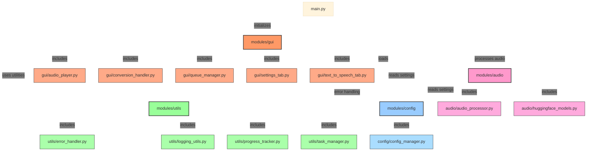

# Text-to-Speech Converter Application (v1.0.0)
A Python desktop application for converting text to speech with multiple engine options.

## What's New in v1.0.0
- Added version number display in application title and UI
- Streamlined application focused solely on text-to-speech functionality
- Added Hugging Face model integration for advanced AI-powered speech synthesis
- Fixed configuration attribute errors
- Improved error handling and logging
- Enhanced queue management system
- Added support for custom button colors and theme settings

## Features
- Text to Speech conversion with multiple options:
  - Online (Google TTS)
  - Offline (local system TTS)
  - AI-powered (Hugging Face models)
- Audio playback with pause/stop controls
- Customizable user interface with light/dark themes
- Drag and drop support for text files
- Progress tracking and detailed status updates
- Automatic pause insertion in text for better speech synthesis
- Save generated audio files

## Branch Information
- The `master` branch contains a stable version of the application that runs, but may not be fully functional
- New features will be developed in separate feature branches
- Updates to the master branch may take longer as they require thorough testing
- Current feature branches:
  - `local_tts`: Development branch for local AI model integration, starting with Hugging Face API (still under active development)

## Requirements
- Python 3.10 or higher
- FFmpeg and FFprobe executables (for audio processing)
- Required Python packages (see requirements.txt)

## Installation
1. Clone the repository:
   ```
   git clone <repository-url>
   cd text-to-speech-app
   ```
2. Create and activate a virtual environment (recommended):
   ```
   python -m venv .venv
   # On Windows:
   .venv\Scripts\activate
   # On Linux/Mac:
   source .venv/bin/activate
   ```
3. Install required packages:
   ```
   pip install -r requirements.txt
   ```
4. Install FFmpeg:
   - Download FFmpeg from https://www.gyan.dev/ffmpeg/builds/ffmpeg-git-full.7z
   - Extract the archive
   - Copy both ffmpeg.exe AND ffprobe.exe from the bin folder to the 'tools' folder in the application directory
5. Install additional system requirements:
   - Install the `tkinter` package if not included in your Python installation:
     ```
     # On Ubuntu/Debian:
     sudo apt-get install python3-tk
     # On Fedora:
     sudo dnf install python3-tkinter
     # On Windows:
     # Tkinter comes with Python installation
     ```

## Running the Application
1. Make sure your virtual environment is activated
2. Run the main script:
   ```
   python main.py
   ```

## Usage
### Text to Speech
1. Enter or paste text into the text area
2. Use the formatting tools to add pauses and improve speech synthesis
3. Choose your TTS engine:
   - Google TTS (online)
   - Local TTS (offline system voices)
   - Hugging Face models (AI-powered)
4. Select your preferred voice
5. Click "Generate Speech" to create the audio
6. Preview the audio and save it if desired

### Settings
- Choose between light and dark themes
- Customize fonts and colors
- All settings are automatically saved

## Troubleshooting
1. FFmpeg Missing Error:
   - Ensure both ffmpeg.exe and ffprobe.exe are in the tools folder
   - Both executables must have execute permissions
2. Audio Playback Issues:
   - Make sure no other application is using your audio device
   - Try restarting the application if audio becomes unresponsive
3. Hugging Face Model Issues:
   - Ensure you have a working internet connection for model downloads
   - Check that you have sufficient disk space for model storage
   - For CUDA acceleration, make sure you have compatible NVIDIA drivers

## Module Architecture
Below is a diagram showing the dependencies between the main modules in the application:



## Contributing
Contributions are welcome! Please feel free to submit a Pull Request.

## License
This project is licensed under the MIT License - see the LICENSE file for details.